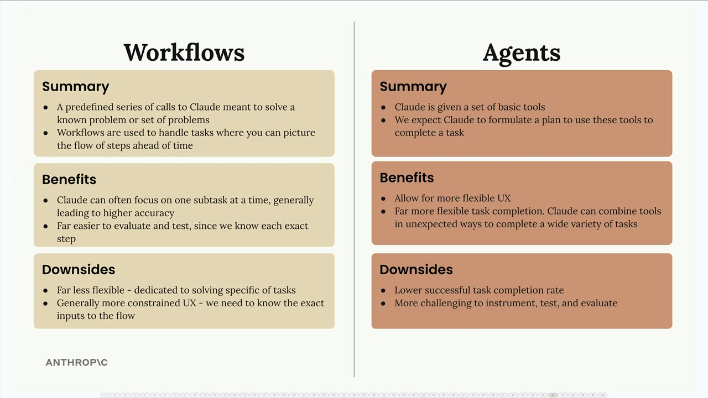

# 09g - 工作流还是 Agent

当构建 AI 应用时，你常常会需要在两种架构方法之间进行选择：工作流和 Agent。两种方法适用于不同的场景，都有其优势和权衡。

## 工作流

### 什么是工作流？

工作流是一系列预定义的 Claude 调用，用于解决若干个已知问题。当你能够预先想象出步骤流程时，可以使用工作流。可以将工作流视为将大任务分解成一系列更小更具体的子任务的方式，每一步都专注于单一目标，使 Claude 能更精准地工作。

### 工作流的优势

- Claude 可以一次专注于一个子任务，带来更高的准确性
- 更容易评估和测试
- 执行更可预测和可靠
- 适合解决具体的、定义明确的问题

### 工作流的缺点

- 不够灵活，只专注于解决特定类型的任务
- 用户体验通常更加受限，用户输入需要确切地匹配流程
- 需要更多前期规划和设计工作

## Agent

### 什么是 Agent？

使用 Agent 时，分配给 Claude 一套工具，期望它制定一个使用这些工具完成任务的规划。与工作流不同，你无法预先知道用户将输入哪些任务，所以寄希望于 Agent 可以通过意想不到的方式组合工具，自适应地、创造性地解决各种挑战。

### Agent 的优势

- 更灵活的用户体验
- 更灵活的任务完成方式
- 能够处理在开发过程中未预料到的新情况
- 必要时可自发请求用户提供额外输入
- 可以一边感知环境一边调整规划，实现 ReAct 范式

### Agent 的缺点

- 与工作流相比，任务的成功完成率通常较低
- 不确定每次运行将执行的步骤，因此更难进行监控、测试和评估
- 整体行为更不可预测

## 何时使用何者

作为工程师，你的主要目标是可靠地解决问题。用户通常并不在乎产品背后是朴素的工作流还是 Fancy 的智能体——他们想要的是能始终如一、稳定工作的产品。

总的来说，当你有明确定义的流程时，考虑使用工作流；当需要处理多样化的不可预测的用户请求，且需要创造性地解决问题时，考虑使用代理。大多数情况下，建议专注于实现工作流，只有在真正需要时才使用 Agent；工作流为大多数生产级应用提供了可靠性和可预测性，而 Agent 则提供在需求无法预先确定情况下的灵活性。
